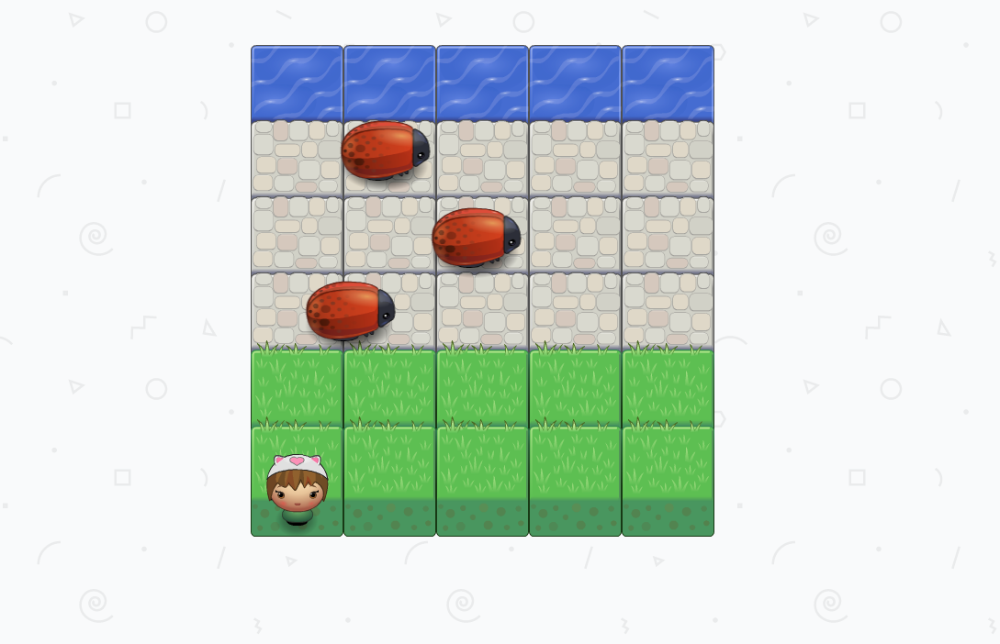

# Classic Arcade Game
--------

This repo serves as a home for the 'Classic Arcade Game' project in the Udacity [Frontend Web Development](https://www.udacity.com/course/front-end-web-developer-nanodegree--nd001) Nanodegree.

This project is an exploration in using object-oriented programming concepts to store and organize information, analyze functions at runtime, and using prototypal inheritance and methods.

You may view the live project [here](https://cynsdaemon.github.io/classic-arcade-game/). Note: You will need to use a modern web browser and have JavaScript enabled.

**To run game on a local machine** Clone or download and unzip this repo. Open this project's ```index.html``` file in your web browser with JavaScript enabled.

How to play
--------
This game is inspired by the [classic Konami 1981 arcade game](https://en.wikipedia.org/wiki/Frogger), Frogger. The player must overcome various platform obstacles to help Frogger safely reach its home at the end of the path.

Colliding with an enemy bug, knocks Frogger back to the beginning of the path, but reaching Frogger's watery home at the end of the path wins the level. :sunglasses:

**To move Frogger:** Use your keyboard's directional arrows (up :arrow_up:, right :arrow_right:, down :arrow_down:, left :arrow_left:) to maneuver around the platform.

Screenshot of Memory Game during play
--------



Resources
--------

This project uses the following style guides and repositories:

- Udacity's Project Grading Rubric and Frontend Nanodegree [Style Guides](https://github.com/udacity/frontend-nanodegree-styleguide)
- This repository contains a simple game engine and script for caching game assets and resources from Udacity's [Arcade Game Project](https://github.com/udacity/frontend-nanodegree-arcade-game) starter code
- Icons courtesy of Font Awesome [CC BY 4.0 License](https://fontawesome.com/license). Learn more about [Font Awesome](https://fontawesome.com/) and its [repository](https://github.com/FortAwesome/Font-Awesome).
- other game fonts courtesty of [Google Fonts](https://fonts.google.com/)

Contributions and Feedback
--------

For feedback and suggestions feel free to open an [issue on Github](https://github.com/cynsdaemon/classic-arcade-game/issues) for this project.


License
--------

This project is build with love :heart: coffee :coffee: and an awesome playlist :musical_note:. Copyright &copy; 2022 [Cynthia Wright](https://heycynwrites.com).

